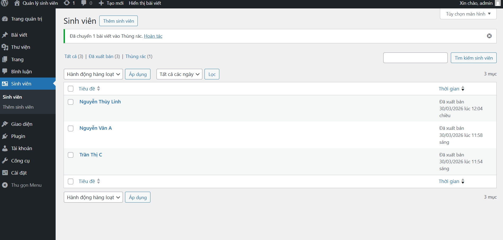
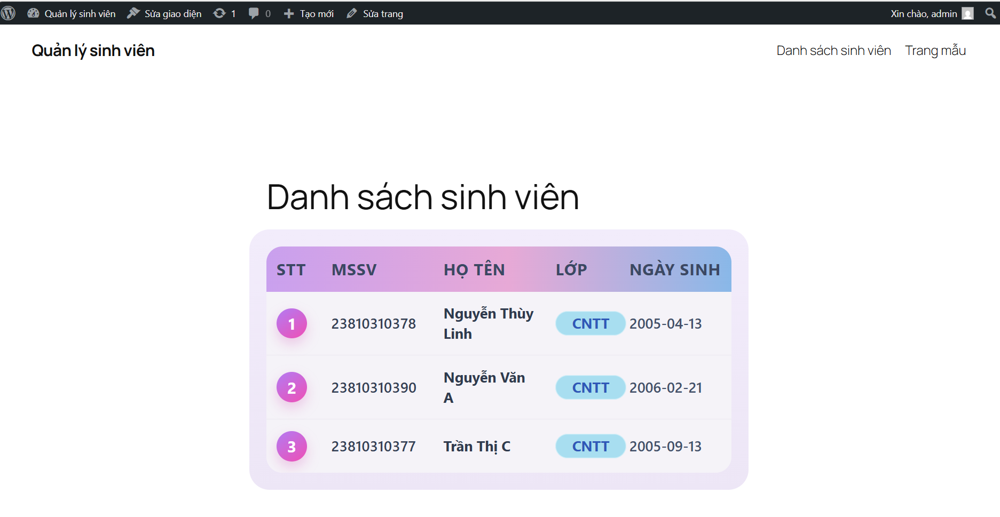

🎓 Student Manager Plugin
Một Plugin WordPress chuyên nghiệp hỗ trợ quản lý thông tin sinh viên, được xây dựng với cấu trúc chuẩn nhằm tối ưu khả năng quản trị và hiển thị dữ liệu linh hoạt qua Shortcode.

🔗 Trải nghiệm dự án
Môi trường chạy: WordPress 6.x / PHP 7.4+

🧰 Tech Stack
Core: PHP (WordPress Plugin API)

Database: MySQL (Custom Post Type & Meta Data)

UI Styling: CSS3 (Custom Table Design)

Security: Nonce Verification & Data Sanitization

Architecture: Modular-based architecture (Chia nhỏ file logic)

🌐 Project Overview
Dự án được thiết kế nhằm cung cấp hệ thống quản lý sinh viên nội bộ đơn giản, bảo mật và dễ dàng tích hợp vào bất kỳ trang web WordPress nào.

🎯 Mục tiêu
Quản trị tập trung: Tạo khu vực "Sinh viên" riêng biệt trong Dashboard.

Dữ liệu tùy biến: Hỗ trợ nhập MSSV, Chuyên ngành và Ngày sinh chính xác.

Hiển thị linh hoạt: Sử dụng Shortcode [danh_sach_sinh_vien] để nhúng bảng dữ liệu vào bất kỳ trang nào.

Bảo mật tối đa: Xử lý dữ liệu an toàn, chống các cuộc tấn công XSS và đảm bảo tính toàn vẹn dữ liệu khi lưu trữ.

## Ảnh chụp kết quả

